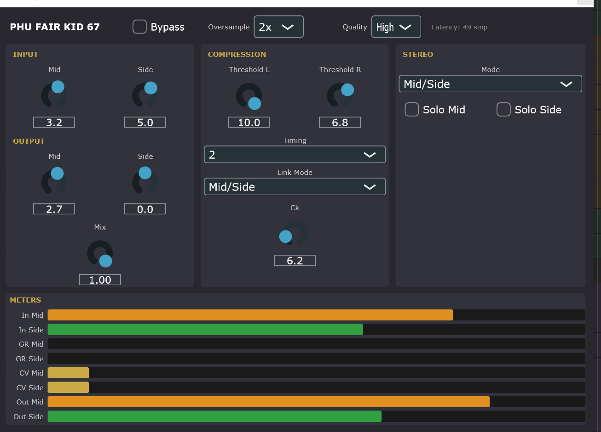

# PHU FAIR KID 67

A free, open-source stereo variable-mu tube compressor plug-in modelled after the circuit topology of the classic **Fairchild 670** levelling amplifier.  
Available as **VST3** (Windows, macOS, Linux) and **AU** (macOS).

---

## Table of Contents

### Part 1 — User Guide
1. [Highlights](#1-highlights)
2. [System Requirements & Installation](#2-system-requirements--installation)
3. [Parameters & Controls](#3-parameters--controls)
4. [How It Works (Technical Approach)](#4-how-it-works-technical-approach)
5. [Further Reading & Web Resources](#5-further-reading--web-resources)

### Part 2 — Building from Source
6. [Build Prerequisites](#6-build-prerequisites)
7. [Cloning the Repository](#7-cloning-the-repository)
8. [Build Instructions](#8-build-instructions)
9. [Running the Tests](#9-running-the-tests)
10. [Project Structure](#10-project-structure)
11. [Contributing](#11-contributing)
12. [License](#12-license)

---

# Part 1 — User Guide

## 1. Highlights



- 🎛️ **Circuit-level tube simulation** — every audio sample is solved through a nonlinear Modified Nodal Analysis (MNA) circuit that faithfully replicates the 6072 variable-mu triode gain stage at the heart of the Fairchild 670. This is the real deal — not a lookup table, not a waveshaper.
- 🎚️ **Authentic sidechain** — full-wave rectifier followed by an attack/release RC envelope follower, with all six original timing positions reproduced from hardware measurements.
- 🔗 **Four stereo link modes** — run channels independently, link them with *Linked Max* (classic bus compression) or *Linked Avg* (softer image preservation), or engage the authentic *Mid/Side (Vert/Lat)* mode where the sidechain is driven by the sum signal — just like the original lateral/vertical switch.
- 🎯 **Per-channel threshold** — independent threshold controls for left and right (or mid and side) channels give you surgical control over where compression sets in on each side.
- 🔬 **Cathode bypass capacitor (Ck)** — a continuous knob from 0 to 47 µF sweeps the low-frequency boost introduced by the cathode bypass capacitor, from a flat, clinical response right through to the warm, full-bodied character of a well-worn 670.
- 📡 **Mid/Side processing** — a dedicated Stereo Mode switch encodes the signal to M/S before the compressor and decodes it afterwards, with solo buttons to audition mid or side independently. Make your mixes breathe in whole new dimensions.
- 📊 **Eight real-time meters** — input level, gain reduction, control voltage, and output level for both channels, updating at 20 Hz directly from the audio thread.
- 🔊 **Optional oversampling** — 1×, 2×, 4×, or 8× with automatic latency compensation keeps aliasing in check even at lower sample rates.
- 🎨 **Custom dark GUI** — a hand-crafted, 740 × 530 pixel interface organised into logical sections with amber-on-dark labels, rotary knobs, and responsive bar meters.
- ⚡ **Draft / High quality modes** — trade CPU load against Newton-Raphson solver accuracy at runtime, no plug-in reload required.
- 🔓 **Fully open source** — MIT-licensed C++17, built on the [JUCE](https://juce.com) framework.

---

## 2. System Requirements & Installation

### Supported Platforms

| Platform | Formats |
|---|---|
| Windows 10 / 11 (64-bit) | VST3 |
| macOS 11 Big Sur or later (Intel & Apple Silicon) | VST3, AU |
| Linux (x86_64) | VST3 |

### Windows — Visual C++ Redistributable Prerequisite

The Windows build is compiled with MSVC and depends on the **Microsoft Visual C++ Redistributable**.  
If the plug-in fails to load in your DAW on Windows, download and install the latest x64 package from Microsoft:

> **[Visual C++ Redistributable for Visual Studio (latest)](https://aka.ms/vs/17/release/vc_redist.x64.exe)**

Most DAW installations already include this runtime; you only need to install it manually if your host reports a missing DLL.

### Installing the Plug-in

1. Download the latest release archive for your platform from the [Releases page](../../releases).
2. **Windows — VST3**  
   Copy `PHU FAIR KID 67.vst3` (the entire folder) to your VST3 plug-in directory, typically:  
   `C:\Program Files\Common Files\VST3\`
3. **macOS — VST3**  
   Copy `PHU FAIR KID 67.vst3` to:  
   `~/Library/Audio/Plug-Ins/VST3/`  
   or the system-wide path `/Library/Audio/Plug-Ins/VST3/`
4. **macOS — AU**  
   Copy `PHU FAIR KID 67.component` to:  
   `~/Library/Audio/Plug-Ins/Components/`  
   or `/Library/Audio/Plug-Ins/Components/`
5. **Linux — VST3**  
   Copy `PHU FAIR KID 67.vst3` to:  
   `~/.vst3/` or `/usr/lib/vst3/`
6. Rescan plug-ins in your DAW. The plug-in appears under the manufacturer name **Phub**.

---

## 3. Parameters & Controls

### Top Bar

| Parameter | Range | Default | Description |
|---|---|---|---|
| **Bypass** | Off / On | Off | Hard bypass that routes the dry signal directly to the output (Mix is forced to 0 internally). |
| **Oversampling** | 1× / 2× / 4× / 8× | 1× | Oversampling factor. Higher values reduce aliasing at the cost of CPU. Plug-in latency is reported to the host automatically. |
| **Quality** | Draft / High | High | Newton-Raphson iteration budget. Draft uses 8 iterations (lower CPU); High uses 20 (more accurate triode simulation). |

### Input / Output

| Parameter | Range | Default | Description |
|---|---|---|---|
| **Input Trim Left** | −20 dB … +20 dB | 0 dB | Per-channel gain applied before the compressor core on the left channel. In Mid/Side mode this trims the Mid signal. |
| **Input Trim Right** | −20 dB … +20 dB | 0 dB | Per-channel gain applied before the compressor core on the right channel. In Mid/Side mode this trims the Side signal. |
| **Output Trim Left** | −20 dB … +20 dB | 0 dB | Per-channel makeup gain applied after the compressor core on the left channel. In Mid/Side mode this trims the Mid signal. |
| **Output Trim Right** | −20 dB … +20 dB | 0 dB | Per-channel makeup gain applied after the compressor core on the right channel. In Mid/Side mode this trims the Side signal. |
| **Mix** | 0 % … 100 % | 100 % | Dry/wet blend. 0 % is fully dry (bypass); 100 % is fully compressed (wet). |

### Compression

| Parameter | Range | Default | Description |
|---|---|---|---|
| **Threshold Left** | 0 … 10 | 5 | Sets the onset of compression for the left channel (or Mid in M/S mode). Higher values increase sensitivity. At 0 the threshold is above any full-scale signal (no compression); at 10 the stage compresses at all times. |
| **Threshold Right** | 0 … 10 | 5 | Same as Threshold Left but for the right channel (or Side in M/S mode). |
| **Timing** | 1 … 6 | 1 | Selects one of six attack/release time-constant pairs from the original hardware switch. See table below. |
| **Link Mode** | Independent / Linked Max / Linked Avg / Mid/Side (Vert/Lat) | Linked Max | Controls how the left and right sidechain envelopes are combined (see §4). |
| **Ck** | 0 … 47 µF | 4.7 µF | Cathode bypass capacitor value on the variable-mu triode stage. Larger values introduce more low-frequency boost and tonal warmth; 0 µF gives a flat, neutral response. |

### Stereo Tools

| Parameter | Range | Default | Description |
|---|---|---|---|
| **Stereo Mode** | Stereo / Mid/Side | Stereo | When set to Mid/Side, the signal is encoded (L/R → M/S) before the input trim, processed through the compressor, then decoded (M/S → L/R) after the output trim. In this mode Input/Output Trim Left controls Mid; Right controls Side. |
| **Solo Left** | Off / On | Off | Mutes the right channel (or Side channel in M/S mode), allowing the left (or Mid) path to be heard in isolation. |
| **Solo Right** | Off / On | Off | Mutes the left channel (or Mid channel in M/S mode), allowing the right (or Side) path to be heard in isolation. |

### Timing Positions

| Position | Attack | Release |
|---|---|---|
| 1 | 0.2 ms | 0.30 s |
| 2 | 0.2 ms | 0.80 s |
| 3 | 0.4 ms | 2.00 s |
| 4 | 0.8 ms | 5.00 s |
| 5 | 2.0 ms | 10.00 s |
| 6 | 8.0 ms | 25.00 s |

Positions 1–2 work well for transient-heavy material (drums, percussion). Positions 3–4 suit program-level levelling. Positions 5–6 produce classic "breathing" programme compression.

### Typical Workflow

1. Insert the plug-in on a stereo bus or mix bus.
2. Use **Input Trim Left/Right** to drive the detector so that gain reduction is visible (the compressor responds to the input level relative to the tube's operating point).
3. Adjust **Threshold Left/Right** to set how aggressively each channel (or M/S component) compresses. Start around 5 and increase for more sensitivity.
4. Choose a **Timing** position — start with position 1 or 2 for transient material, 3–4 for levelling.
5. Set **Link Mode** to *Linked Max* for standard stereo bus compression. Use *Independent* when left and right sources need different amounts of compression. Use *Mid/Side (Vert/Lat)* for lateral/vertical-style operation where the sidechain follows the sum.
6. For M/S compression, switch **Stereo Mode** to *Mid/Side*. Use **Solo L** / **Solo R** to audition the mid and side components individually.
7. Compensate output level with **Output Trim Left/Right**.
8. Use **Mix** for parallel compression.
9. Dial in **Ck** to taste — lower values give a flatter, more transparent response; higher values add low-end body and warmth.
10. Enable **Oversampling** (2× or 4×) if you hear harsh aliasing artefacts, particularly at lower sample rates.

---

## 4. How It Works (Technical Approach)

### Variable-Mu Gain Stage

Unlike threshold-based compressors, a variable-mu compressor has no explicit threshold knob. Compression occurs because the triode tube's gain naturally decreases as the grid is driven more negative. In this plug-in, the sidechain detector produces a control voltage (CV) that is summed with the audio-grid bias. Stronger input signals produce a higher CV, which drives the grid more negative, reducing gain in a smooth, programme-dependent way.

The gain stage is implemented by solving — on every audio sample — the nonlinear circuit equations of a triode connected as a common-cathode amplifier:

```
Vcc ─── Rp ──── Plate (Vp)
                  │
               [6072 triode]
                  │
            Cathode (Vk) ──── Rk ──── GND
                  │
                 Ck (optional bypass cap)

Grid voltage = clamped audio input − CV bias
```

The tube is modelled using the **Koren triode model** (Norman L. Koren, 1996), which provides accurate analytical plate-current equations and their partial derivatives. A 2×2 **Newton-Raphson** (NR) solver iterates to find the plate and cathode voltages that satisfy Kirchhoff's laws at each sample, using the previous sample's solution as a warm-start.

### Cathode Bypass Capacitor (Ck)

A bypass capacitor placed across the cathode resistor (Rk) removes the local feedback in the gain stage at audio frequencies. Without it (Ck = 0), the cathode resistor introduces degeneration that rolls off low-frequency gain. With a large Ck, the low-frequency response is restored, adding warmth and body. The **Ck** knob sweeps this capacitance continuously from 0 µF (flat) to 47 µF (maximum low-end enrichment), allowing the tonal character of the compressor to be dialled in from neutral to full vintage colour.

### Sidechain Detector

The sidechain performs two operations on each input sample:

1. **Full-wave rectification** — `|Vin|` scaled from normalised audio to volts (±1 full-scale = ±10 V).
2. **Attack/release RC smoothing** — a one-pole IIR filter with a fast attack coefficient (quick to respond to loud transients) and a slow release coefficient (gradual return to silence). Coefficients are derived from `α = exp(−1 / (τ · fs))`.

The smoothed CV is clamped to a safe range (`[0, 6 V]`) before being applied to the gain stage grid.

### Threshold

The **Threshold** parameter subtracts a fixed voltage from the raw detector CV before it reaches the gain stage:

```
effectiveCV = max(0, detectorCV − thresholdVoltage)
```

`thresholdVoltage = 10 − param`. At param = 0 the threshold is 10 V, which is above any full-scale signal output (no compression). At param = 10 the threshold is 0 V (always compressing). The default of 5 gives a threshold of 5 V, which corresponds approximately to −6 dBFS onset. Independent left and right threshold knobs allow different amounts of compression on each channel.

### Stereo Link Modes

| Mode | Behaviour |
|---|---|
| **Independent** | Each channel has its own detector and CV. Stereo image can shift under asymmetric signals. |
| **Linked Max** | Both channels share the louder channel's CV. Classic bus compression behaviour; image is preserved. |
| **Linked Avg** | Both channels share the average of the two CVs. Softer image-preservation with slightly less aggressive compression on loud transients. |
| **Mid/Side (Vert/Lat)** | The sidechain is driven by the Mid (L+R) signal only. Both gain stages receive the same mid-derived CV, replicating the lateral/vertical behaviour of the original hardware. This mode is independent of the Stereo Mode switch and acts purely at the sidechain level. |

### Mid/Side Processing (Stereo Mode)

When **Stereo Mode** is set to *Mid/Side*, the full M/S encode/decode matrix is inserted around the compressor core:

1. **Encode** (before Input Trim): `M = (L + R) / 2`, `S = (L − R) / 2`. The 0.5 factor keeps the M and S signals within the ±1.0 normalised range even when both channels are at full scale.
2. The compressor (Input Trim → Core → Output Trim) then operates on M and S as independent channels.
3. **Decode** (after Output Trim): `L = M + S`, `R = M − S`. Restores unity gain end-to-end.

**Solo** buttons work before the decode step: soloing Left zeroes the S channel before decoding, resulting in a mono mid signal on both outputs. Soloing Right zeroes the M channel, resulting in a side-only signal.

### Oversampling

The nonlinear triode stage can produce harmonic distortion that folds back into the audio band (aliasing) at standard sample rates. The plug-in optionally upsamples the audio by 2×, 4×, or 8× before passing it through the core and then downsamples on the way out, using JUCE's polyphase oversampling filters. The resulting latency (in samples at the host rate) is reported to the DAW so that it can apply delay compensation automatically.

### Meters

Eight bar meters at the bottom of the GUI update at 20 Hz and show:

| Meter | Description |
|---|---|
| **In L / In R** | Input peak level in dBFS (green → amber → red near 0 dBFS). |
| **GR L / GR R** | Gain reduction in dB (0 = no reduction; bar fills rightward as compression increases). |
| **CV L / CV R** | Raw sidechain control voltage (0–6 V) after the RC envelope follower. |
| **Out L / Out R** | Output peak level in dBFS after the output trim. |

---

## 5. Further Reading & Web Resources

- **Fairchild 670 original circuit** — [Fairchild 670 Service Manual (Gyraf Audio archive)](https://www.gyraf.dk/gy_pd/fairchild/fairchild.htm)
- **Koren triode model** — Norman L. Koren, *"Improved Vacuum-Tube Models for SPICE Simulations"*, Glass Audio, 1996 — [www.normankoren.com/Audio/Tubemodels.html](http://www.normankoren.com/Audio/Tubemodels.html)
- **Variable-mu compression** — [RecordingHacks: Fairchild 670 overview](https://recordinghacks.com/compressors/fairchild/670/)
- **JUCE audio framework** — [juce.com](https://juce.com)
- **VST3 SDK** — [steinbergmedia.github.io/vst3_doc](https://steinbergmedia.github.io/vst3_doc/)
- **Modified Nodal Analysis (MNA)** — [QUCS Technical Papers — MNA](http://qucs.sourceforge.net/tech/node14.html)

---

# Part 2 — Building from Source

> This section is for developers and contributors who want to compile the plug-in themselves, modify the DSP code, or run the unit tests.

## 6. Build Prerequisites

### All Platforms

| Tool | Minimum Version | Notes |
|---|---|---|
| **CMake** | 3.15 | 3.23+ recommended (required for CMake Presets) |
| **C++ compiler** | C++17 | See platform-specific requirements below |
| **Git** | Any recent | Needed for submodule checkout |

### Windows

| Tool | Notes |
|---|---|
| **Visual Studio 2022 or later** | Desktop C++ workload required |
| **Windows SDK** | Included with Visual Studio |

> The `CMakePresets.json` file includes a `vs2026-x64` preset. If you are on Visual Studio 2022, use `cmake -G "Visual Studio 17 2022"` instead.

### macOS

| Tool | Notes |
|---|---|
| **Xcode 13 or later** | Command Line Tools are not sufficient; the full Xcode app is required for AU builds |
| **macOS 11 SDK or later** | Included with Xcode |

### Linux

| Package | Notes |
|---|---|
| `build-essential` / `gcc` / `clang` | C++17-capable compiler |
| JUCE system dependencies | See [JUCE Linux dependencies](https://github.com/juce-framework/JUCE/blob/master/docs/Linux%20Dependencies.md) — typically: `libasound2-dev libfreetype6-dev libx11-dev libxinerama-dev libxrandr-dev libxcursor-dev mesa-common-dev` |

---

## 7. Cloning the Repository

The project uses Git submodules for JUCE and `phu-audio-lib`. Always clone recursively:

```bash
git clone --recurse-submodules https://github.com/huberp/phu-fair-kid-67.git
cd phu-fair-kid-67
```

If you already cloned without submodules:

```bash
git submodule update --init --recursive
```

---

## 8. Build Instructions

### Option A — Using CMake Presets (recommended)

Presets are defined in `CMakePresets.json`.

**Windows (VST3, x64 Release)**
```bat
cmake --preset vs2026-x64
cmake --build --preset release
```
The VST3 bundle is written to `build/vs2026-x64/src/phu-fair-kid-67_artefacts/Release/VST3/`.

**macOS Intel (VST3 + AU, Release)**
```bash
cmake --preset macos-x86_64-release
cmake --build --preset macos-x86_64-build
```

**macOS Apple Silicon (VST3 + AU, Release)**
```bash
cmake --preset macos-arm64-release
cmake --build --preset macos-arm64-build
```

**Linux (VST3, Release)**
```bash
cmake --preset linux-release
cmake --build --preset linux-build
```

### Option B — Manual CMake Invocation

```bash
cmake -B build \
      -DCMAKE_BUILD_TYPE=Release \
      -DPHU_BUILD_PLUGIN=ON
cmake --build build --config Release
```

### Build Without the Plug-in (DSP tests only)

```bash
cmake -B build -DPHU_BUILD_PLUGIN=OFF
cmake --build build
```

This skips JUCE and the audio plug-in target; only the unit-test executables are compiled. No platform audio SDKs are required.

---

## 9. Running the Tests

After building (with or without the plug-in):

```bash
cd build
ctest --output-on-failure
```

### Test Suites

| Test executable / CTest name | Area covered |
|---|---|
| `phu_fairchild670core_tests` | Stereo core: link modes, timing positions, meter readback |
| `phu_variable_mu_tests` | Variable-mu triode stage NR convergence and gain behaviour |
| `phu_transformer_linear_tests` | Transformer coloration model (HPF + LPF + saturation) |
| `phu_transformer_coupling_tests` | Coupled inductor trapezoidal companion models |
| `phu_circuit_linear_tests` | MNA linear circuit primitives |
| `phu_detector_tests` | Sidechain rectifier/envelope detector |
| `phu_nr_policy_tests` | Newton-Raphson iteration policy |
| `phu_triode_koren_tests` | Koren triode plate-current model |
| `phu_tube_stage_tests` | Common-cathode tube stage circuit |

---

## 10. Project Structure

```
phu-fair-kid-67/
├── src/
│   ├── PluginProcessor.{h,cpp}       # JUCE AudioProcessor (parameters, processBlock)
│   ├── PluginEditor.{h,cpp}          # JUCE AudioProcessorEditor (full custom GUI)
│   └── DSP/
│       ├── DbConversion.h            # dB ↔ linear helpers
│       ├── UnitScaling.h             # normalised samples ↔ volts
│       ├── Circuit/
│       │   ├── Circuit.{h,cpp}       # MNA matrix stamping utilities
│       │   ├── Elements/             # Capacitor / inductor companion models
│       │   └── Nonlinear/
│       │       ├── TriodeKoren.{h,cpp} # Koren triode model + derivatives
│       │       └── NR.{h,cpp}          # Newton-Raphson solver & policy
│       ├── Models/
│       │   ├── TubeStage.{h,cpp}     # Common-cathode tube stage (baseline)
│       │   ├── Transformer/          # TransformerLinear coloration model
│       │   ├── Fairchild/
│       │   │   ├── Fairchild670Core.{h,cpp}  # Stereo compressor core (link modes, meters)
│       │   │   └── VariableMuStage.{h,cpp}   # Variable-mu triode gain stage
│       │   └── Sidechain/
│       │       ├── TimingNetwork.{h,cpp}     # Timing presets & RC coefficients
│       │       └── RectifierDetector.{h,cpp} # Full-wave rectifier envelope detector
│       └── Utils/
│           └── OversamplingChain.{h,cpp}     # JUCE oversampling wrapper
├── docs/
│   └── phu-fair-kid-screenshot.png   # GUI screenshot
├── tests/                            # Catch2-based unit tests
├── JUCE/                             # Git submodule — JUCE framework
├── phu-audio-lib/                    # Git submodule — shared audio utilities
├── CMakeLists.txt
└── CMakePresets.json
```

---

## 11. Contributing

Contributions are welcome. Please:

1. Fork the repository and create a feature branch from `main`.
2. Keep new code in C++17 and follow the style of surrounding files (no raw owning pointers, prefer value types and `unique_ptr`).
3. Add or update unit tests in `tests/` for any DSP logic changes.
4. Ensure `ctest` passes locally before opening a pull request.
5. Describe what the change does and, for DSP changes, include a brief note on how you verified correctness (expected level, transfer-function check, etc.).

---

## 12. License

This project is released under the **MIT License**. See [LICENSE](LICENSE) for the full text.

Third-party components:
- **JUCE** — [ISC / proprietary dual licence](https://github.com/juce-framework/JUCE/blob/master/LICENSE.md) (check JUCE's licensing terms for commercial use)
- **phu-audio-lib** — see `phu-audio-lib/LICENSE`